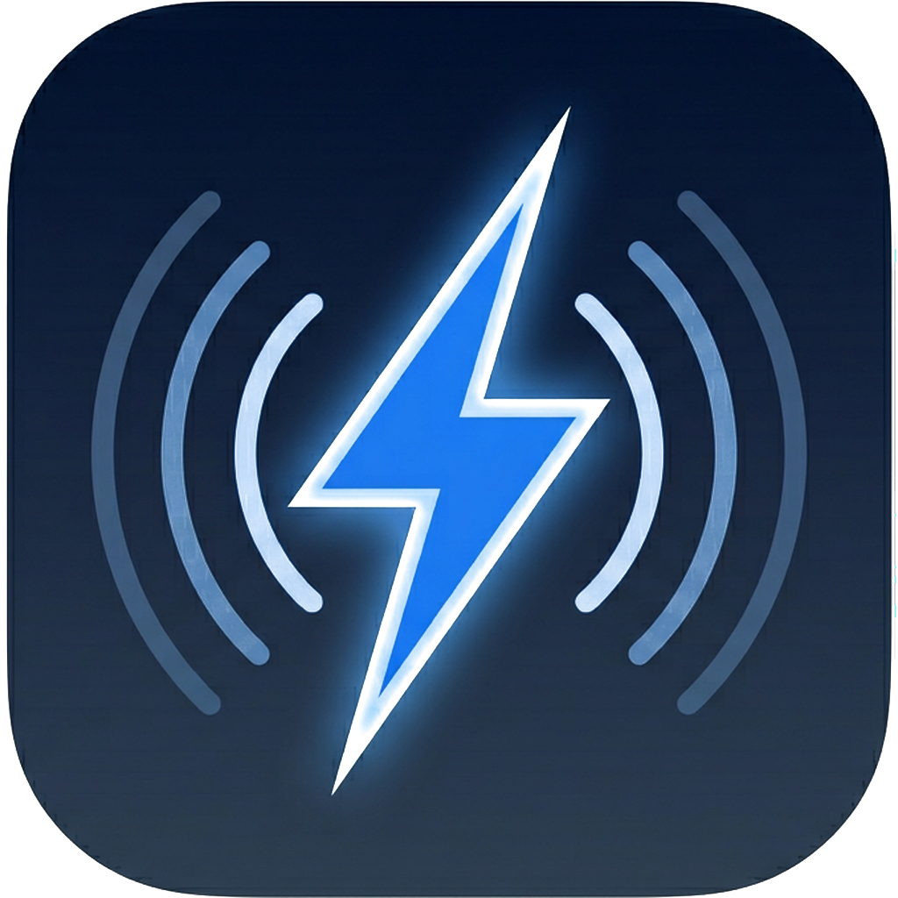

<p align="center">
  
</p>

<h1 align="center">ThunderTalk</h1>

<p align="center">
  Lightning-fast, privacy-first voice-to-text for every desktop.
</p>

<p align="center">
  <a href="LICENSE"></a>
  
  
</p>

---

## Features

- **Press a key, speak, get text.** One hotkey activates voice input anywhere on your desktop.
- **100% local & private** — your voice never leaves your device. No cloud, no subscription.
- **Multiple ASR backends** — MLX (Metal GPU on Apple Silicon) and ONNX (CPU).
- **Multiple ASR models** — SenseVoice, FunASR-Nano, Qwen3-ASR in various sizes.
- **Hotwords & auto-learning** — custom vocabulary for domain-specific terms, with automatic frequency-based learning.
- **Smart hardware detection** — identifies your CPU, RAM, and GPU to recommend the best model.
- **Speaker mute** — optionally mutes system audio during recording to avoid feedback.
- **Dark & Light themes** — pick whichever feels right.
- **English & 中文 UI** — switch the interface language in Settings.

## Download

Download the latest **ThunderTalk.app** from [Releases](https://github.com/realAllenSong/ThunderTalk/releases).

> **macOS**: After downloading, move `ThunderTalk.app` to your Applications folder. On first launch, grant **Microphone** and **Accessibility** permissions when prompted.

## Supported Models

| Model | Size | Backend | Languages | Accuracy | Hotwords |
|-------|------|---------|-----------|----------|----------|
| SenseVoice-Small | 241 MB | ONNX (CPU) | 5 | ★★★☆☆ | No |
| Qwen3-ASR-0.6B | 940 MB | ONNX (CPU) | 52 | ★★★★★ | Yes |
| Qwen3-ASR-0.6B | ~1.2 GB | MLX (Metal GPU) | 52 | ★★★★★ | Yes |
| Qwen3-ASR-1.7B | ~3.4 GB | MLX (Metal GPU) | 52 | ★★★★★ | Yes |

Models are downloaded on-demand from the app's Settings page and stored at `~/.thundertalk/models/`.

## Usage

1. Click the **ThunderTalk** icon in the menu bar → **Open Settings** → download a model.
2. Press the hotkey (default: **Right ⌘**) to start recording. Press again to stop.
3. The transcribed text is automatically pasted into the active application.

> Change the hotkey, language (English / 中文), theme (dark / light), and more from the **Settings** page.

## Development

```bash
# Install uv (if you don't have it)
curl -LsSf https://astral.sh/uv/install.sh | sh

# Clone and install
git clone https://github.com/realAllenSong/ThunderTalk.git
cd ThunderTalk
uv sync

# (Apple Silicon) Install MLX backend for GPU acceleration
uv sync --extra mlx

# Run from source
uv run python run.py

# Build macOS .app
.venv/bin/python build_macos.py
# Output: dist/ThunderTalk.app
```

## Tech Stack

- **UI**: [PySide6](https://doc.qt.io/qtforpython-6/) (Qt6)
- **ASR**: [sherpa-onnx](https://github.com/k2-fsa/sherpa-onnx) (ONNX), [mlx-qwen3-asr](https://github.com/nicoboss/mlx-qwen3-asr) (MLX)
- **Audio**: [sounddevice](https://python-sounddevice.readthedocs.io/)
- **Hotkeys**: Native NSEvent (macOS)
- **Build**: [PyInstaller](https://pyinstaller.org/) + Apple Development code signing

## License

[Apache-2.0](LICENSE)

## Acknowledgments

- [sherpa-onnx](https://github.com/k2-fsa/sherpa-onnx) — cross-platform ASR inference
- [mlx-qwen3-asr](https://github.com/nicoboss/mlx-qwen3-asr) — MLX-native Qwen3 ASR
- [SenseVoice](https://github.com/FunAudioLLM/SenseVoice) — lightweight ASR model
- [Qwen3-ASR](https://github.com/QwenLM/Qwen3-ASR) — state-of-the-art ASR
