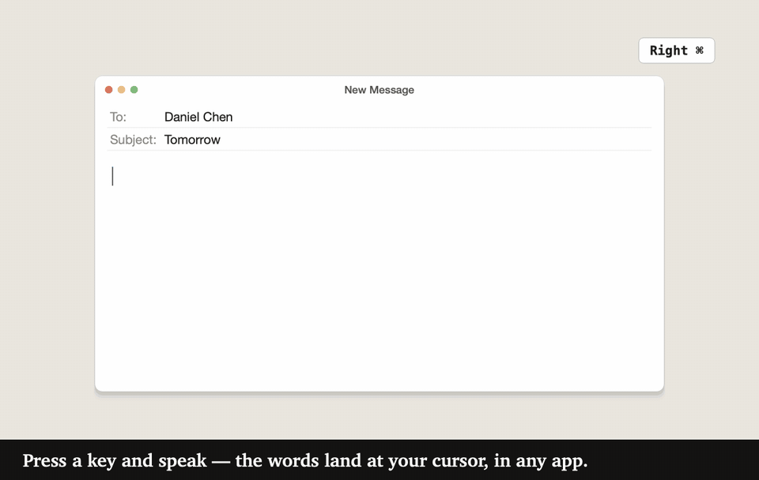

<p align="center">
  
</p>

<h1 align="center">ThunderTalk</h1>

<p align="center">
  免费开源的 macOS 语音输入应用。<br/>
  按下快捷键、开口说话，文字就出现在光标处。<br/>
  语音识别在你自己的 Mac 上完成：无需账号，无需订阅，没有云端。
</p>

<p align="center">
  <a href="README.md">English</a> · <a href="https://realallensong.github.io/ThunderTalk/">官网</a> · <a href="https://github.com/realAllenSong/ThunderTalk/releases/latest">下载</a>
</p>

<p align="center">
  <a href="LICENSE"></a>
  
  <a href="https://github.com/realAllenSong/ThunderTalk/releases/latest"></a>
  <a href="https://github.com/realAllenSong/ThunderTalk/releases"></a>
</p>

<p align="center">
  
  <br/><sub>录音条和工作室画面取自 App 自身界面（邮件窗口是示意）。听写的句子、会议转写和朗读语音都是模型在 M3 Max 上的真实输出，只有镜头节奏是脚本控制的。</sub>
</p>

---

ThunderTalk 是一款 macOS 语音输入应用。在任意应用里按下快捷键，说出你想写的内容，文字就落在光标所在的位置。识别在你的本机完成：通过 MLX 使用 Apple Silicon 的 GPU，或通过 ONNX 使用 CPU，所以你的录音不会发往任何地方。它以 MIT 协议开源，是 **Typeless**、**Wispr Flow**、**superwhisper** 以及 macOS 自带听写的开源替代品。

界面刻意保持安静：暖色纸面背景、近黑的墨色、唯一一种橙色强调色，动效只用在有信息量的地方（实时音量条、加载圈、真实的下载进度）。

## v1.7.0 新功能

- **边说边看文字：**“实时预览”在录音条中显示临时识别结果，默认开启；最终文字仍来自整段录音的完整识别。
- **AI 校对：**可选的 AI 校对复用你已有的服务，按上下文修正识别错的名称、术语和同音字，不改写你说的话。
- **工作室更实用：**转写网页链接、批量处理多个文件或链接、把字幕烧录进视频副本，并生成 AI 会议纪要。
- **下载更小：**zip 约 224 MB，安装后约 592 MiB，原来分别为 330 MB 和 961 MiB。翻译与 IndexTTS 共用按需下载的 90 MB PyTorch 组件，模型权重另计。
- **修复中文翻译：**“直译”模式以中文（普通话）为目标语言时，现在会输出中文，不再保留英文语音原文。

## 新功能：工作室（Studio）

工作室取代了原来的“实验室”页，分为“转写”和“朗读”两部分。

**转写。** 把音频或视频录音（m4a、mp3、wav、mp4、mov 等）拖进来，就能得到带时间戳的文字稿。可选择已下载的语音识别模型，默认使用当前听写模型。需要区分说话人时，选择 **MOSS-Transcribe-Diarize** 并勾选“标注说话人”；点击说话人即可改名。尚未下载 MOSS 时，选择它会启动下载。可导出为 TXT、Markdown、SRT、VTT 或 JSON。常见格式用 macOS 自带的工具解码；WebM、MKV 等部分格式可能需要 ffmpeg。

**链接转写。** 把 YouTube、Bilibili 或 yt-dlp 支持的其他网站的单个视频链接粘贴到工作室的链接输入框，再开始转写。应用已内置 yt-dlp，无需另行安装。下载的音频在你的 Mac 上转写，用完即删。会员专享及其他需要登录的限制会给出提示，ThunderTalk 不会代你登录。如果网站提供的试看片段明显短于标示的总时长，工作室会提醒文稿只包含这一部分。不支持播放列表、频道或直播。

**批量队列。** 添加多个文件或链接，选择导出格式（TXT、Markdown、SRT、VTT 或 JSON）和目标文件夹，再点“全部转写”。每次处理一项，结果自动保存。也可以选“原文件旁”，此时链接结果保存到“下载”文件夹。可取消单项或整个队列。成功项自动移出队列，失败或取消的项目保留，可重试或移除。最新文稿继续显示在下方，每份完成的转写都会保存到“历史记录”。已有导出文件会保留，重名时自动添加编号。

**视频字幕。** 本地视频转写完成后，点“给视频加字幕…”，再选择“把字幕直接印在画面上（始终可见）”或“添加字幕轨（观看时可以开关）”。印在画面上的字幕采用白色苹方文字，衬半透明深色圆角底框，字号随视频大小调整，在繁杂画面和原有文字上也清晰可读。字幕轨方式不改动原视频画面。这一步需要 ffmpeg，应用未内置：如果使用 [Homebrew](https://brew.sh/)，在终端运行 `brew install ffmpeg`，然后重试。常见格式的普通转写不需要安装它。链接转写下载的是音频，因此烧录字幕需要本地视频文件。

**转写历史记录。** 可重新打开、重命名、删除文稿，或按标题和正文搜索。列表每次加载 50 项，只在打开时读取完整文稿。文件、链接和批量转写保存在 `~/.thundertalk/transcripts/<id>/`，包含文稿 JSON 和来源、时长、模型、日期、说话人名称及生成纪要等元数据。

**AI 会议纪要。** 转写后，可按文稿的中文或英文生成摘要、要点、决定、行动项与待解决问题。纪要复用「AI 校对」页面选择的服务与模型，校对开关可保持关闭，不会下载模型。可复制或保存为 Markdown，也会纳入文稿的 Markdown 导出。队列勾选后，每项转写完成即生成纪要，并同时保存 Markdown。长文稿按约 6,000 字符分段，最多 16 段加一次合并，每次请求限 60 秒，可取消。云端 CLI 会把文稿内容发送给服务商；Ollama、LM Studio 使用本机服务。纪要会要求将未说明的负责人或期限标为「未提及」，请对照文稿核对生成的纪要。

**朗读。** 把文字读出来，可在三个本地引擎之间选择：

- **VoxCPM2**（OpenBMB）：48 kHz 录音棚音质，支持声音克隆；在 Apple 芯片上约为实时速度。
- **IndexTTS-2.5**（bilibili）：克隆还原度很高，支持中、英、日、西、阿语；约为实时速度。
- **Kokoro**（8200 万参数）：小巧快速（CPU 上约为实时的 4 倍），内置 23 个精选音色（20 个中文、3 个英文）。
- VoxCPM2 与 IndexTTS 内置 18 个音色，都是短视频、Vlog、播客里常见的风格：影视解说、纪录片旁白、科普讲述、商业解读、新闻主播、霸道总裁、两种闺蜜分享、台湾腔，以及英文 YouTuber、播客和旁白。全部是“设计”出来的音色（由 VoxCPM2 根据文字描述生成，不是真人录音，也不模仿任何平台的音色），随应用一起提供。
- 每个音色都能试听：点音色上的 ▶，不用生成就能先听一听。
- 可调语速（0.75x 到 1.5x），带可拖动进度的播放器。结果可保存为 WAV（无损）或 M4A（体积小）。
- **我的声音：** 录制或导入 5 到 15 秒你自己的声音，就能用 VoxCPM2 或 IndexTTS 以你的声音朗读任何内容。参考音频保存在你 Mac 上的 `~/.thundertalk/voices`。请只克隆你有权使用的声音。

语音引擎只需下载一次，之后文件转写与语音生成可离线使用。可选的 AI 纪要使用你选择的服务；网页链接和云端服务需要联网。

## 功能特性

**听写**

- 一个全局快捷键，任意应用都能用。默认是 Right ⌘；可以在“设置”里选择“切换”（按一下开始、再按一下结束）或“长按”，也可以更换按键或组合键。
- **实时预览：**说话时可在悬浮录音条里看到临时文字。“设置 ▸ 实时预览”默认开启。文字可能随后续语音修订，结束录音后仍会完整识别整段音频，生成最终粘贴内容。重复循环的预览窗口会被丢弃；保守合并可在干净预览与最终中文片段准确对齐时恢复拉丁字母术语。“直译”模式不显示预览；模型跟不上时，预览可能暂停或停止到本次录音结束。
- 多种语音模型：Qwen3-ASR 0.6B 与 1.7B、SenseVoice-Small、NVIDIA Parakeet-TDT、MOSS-Transcribe-Diarize。应用会读取你的硬件并推荐合适的模型。
- 中文、英文，以及同一句话里的中英混说。界面本身也有英文和中文两种语言。
- 热词：把总是听错的产品名、缩写、人名教给它（适用于 Qwen3-ASR 系列模型）。
- 逆文本规整：口述的数字会变成阿拉伯数字，中英文都支持（“twenty five”变成 25，“三百五十二”变成 352）。
- 可选的翻译，通过 SeamlessM4T v2 支持 100+ 种语言：“直译”模式结束录音后粘贴译文，“审阅”模式先转写，再由你选择替换或保留原文。
- 可搜索的历史记录，保存为 `~/.thundertalk` 里的普通文件。
- **最近录音：**默认开启，将最近 20 次听写以 16 kHz 单声道 WAV 和识别元数据保存到 `~/.thundertalk/recordings/`，仅储存在这台 Mac 上，绝不上传。在“设置 ▸ 保留最近录音”关闭后不再保存新录音，已有录音仍保留。
- 中英双语整句语音命令（默认开启，不依赖 AI 润色，可在设置中关闭）：「换行 / new line」「新段落 / new paragraph」「删掉上一句 / delete that」（撤销最后一段未被操作的听写）及「制表符 / tab key」。为该应用开启 AI 润色后，录音前选中文字，再说「改得正式一点 / make this more formal」「简短一点 / make this shorter」或「翻译成英文 / translate to English」（也支持「翻译成中文 / translate to Chinese」）即可编辑选中内容。读取选区需要 macOS 辅助功能支持，完整剪贴板会保存并恢复。
- **AI 校对：**使用已有且登录的 Codex、Claude Code、Gemini、Grok 或 Cursor CLI，已安装模型的 Ollama / LM Studio，Cherry Studio API 服务，或自定义 OpenAI 兼容 API。不内置或下载 AI 模型。在侧边栏打开「AI 校对」：服务会自动检测，每个服务显示是否可用、需要登录或未运行；模型列表从服务读取，无法列出的模型会用一次测试调用确认可用。可按名称或准确 ID 搜索模型；Cursor 的推理档位按模型合并，支持的推理强度分别保存，默认低强度。校对结合句子上下文、你的热词和模型知识，修正识别错的词——产品与模型名称、专业术语、同音字。只做最小修改：不翻译、不切换中英文、不改格式、不回答问题。仅用于普通听写，不用于直译或审阅翻译。原始文字会立即粘贴；只有在你没有打字、点击、滚动或切换应用时，才会原地替换为校对结果。临时故障会在五秒后自动重试一次；失败会显示具体原因并保留原文。替换完成后，浮动条以整行宽度显示完整文字，划掉原词并在旁边显示修正文字。按三行一页自动翻页（没有改动的页会跳过），显示页码，每页停留 3–6 秒，总阅读时间不超过 25 秒；最后一页注明未展示的改动数量。悬停可暂停，点击可关闭，开始新录音会立即替换差异展示。终端里的结果会跳过，因为终端输入没有标准的粘贴撤销。

**日常细节**

- 第一次运行有引导：欢迎、权限、选模型、试一试。
- 模型下载显示来自真实字节数的进度，网络中断后可以续传，“取消”立即生效。
- 应用内自动更新：有新版本发布时弹出一个小提示，点一下就会下载、替换并重启。
- 可选的录音时静音扬声器，避免麦克风拾取你自己的声音。
- 内存模式（“设置 → 性能”）：牺牲一些 KV 缓存与线程数，换取约 3 GB 的内存占用降低。
- Studio 语音模型、MOSS 说话人转写与翻译在空闲三分钟后释放模型，下次使用时重新加载。听写与实时预览共用常驻的听写模型，每项任务完成后清理临时 MLX 缓冲。翻译使用独立工作进程，空闲时退出，同时归还 PyTorch 保留的内存。

**隐私**

- 无账号、无订阅、无使用次数限制。
- 音频在你的 Mac 上识别，绝不上传。
- 网络用于下载模型/组件、检查 GitHub Releases 更新和获取工作室链接。AI 校对默认关闭；可选的校对与会议纪要使用你选择的服务。云端 CLI 使用你的账号，将听写或文稿文字发送给对应服务。Ollama 和 LM Studio 在本机推理；Cherry Studio 与自定义 API 可能将文字转发给云端模型。
- 代码开源，可以阅读、自行构建、随意 fork。

## 下载

用 Homebrew：

```sh
brew install --cask realallensong/tap/thundertalk
```

或者从 [Releases](https://github.com/realAllenSong/ThunderTalk/releases/latest) 下载最新的 **ThunderTalk.app**，移到“应用程序”文件夹后打开。首次启动时按提示授予“麦克风”和“辅助功能”权限（“辅助功能”让 ThunderTalk 能替你把文字输入到光标处）。

ThunderTalk 尚未使用 Apple Developer ID 进行公证，所以从浏览器下载后首次打开时 macOS 会给出警告。请看下文 [首次打开提示“无法打开 / 无法验证开发者”](#首次打开提示无法打开--无法验证开发者)，大约十秒就能搞定。

## 使用方法

1. 打开 ThunderTalk，按首次运行引导操作，或进入“模型”页下载一个模型。
2. 点进任意应用里的任意输入框。
3. 按下快捷键（默认 **Right ⌘**），说话，再按一次结束，文字会粘贴到光标处。

在“设置”里可以修改快捷键、按键模式、麦克风和界面语言。打开“工作室”可以转写文件/链接、批量导出、制作字幕、生成会议纪要和文字转语音。

## 支持的模型

### 语音识别（ASR）

| 模型 | 大小 | 后端 | 语言 | 准确度 | 热词 |
|------|------|------|------|--------|------|
| SenseVoice-Small | 241 MB | ONNX (CPU) | 5 | ★★★☆☆ | 否 |
| Qwen3-ASR-0.6B | 940 MB | ONNX (CPU) | 52 | ★★★★★ | 是 |
| Qwen3-ASR-0.6B | ~1.9 GB | MLX (Metal GPU) | 52 | ★★★★★ | 是 |
| Qwen3-ASR-1.7B | ~4.7 GB | MLX (Metal GPU) | 52 | ★★★★★ | 是 |
| MOSS-Transcribe-Diarize 0.9B | ~1.8 GB | MLX (Metal GPU) | 50+ | ★★★★★ | 否 |
| Parakeet-TDT 0.6B v3 | 640 MB | ONNX (CPU) | 25（欧洲语言） | ★★★★★ | 否 |
| Parakeet-TDT 0.6B v2 | 640 MB | ONNX (CPU) | 英语 | ★★★★★ | 否 |

> **MOSS-Transcribe-Diarize**（[OpenMOSS](https://github.com/OpenMOSS/MOSS-Transcribe-Diarize)，INTERSPEECH 2026 第二届 MLC-SLM 挑战赛第一名）是多说话人模型。听写时它粘贴纯文本（模型卡片上有可选的 S01:/S02: 说话人标签开关），同时它也驱动工作室的“标注说话人”选项，单次即可转写最长约 90 分钟的录音，并附说话人标签和时间戳。
>
> **Parakeet-TDT**（NVIDIA）以 CPU 运行，自带标点和大小写。在 M3 Max 上识别速度约为实时的 50 倍（RTF 0.019），约为 Qwen3-ASR ONNX 的 4 倍。

### 文字转语音（工作室）

| 模型 | 大小 | 后端 | 用途 |
|------|------|------|------|
| VoxCPM2（8-bit，Apache-2.0） | 3.2 GB | MLX (Metal GPU) | 内置音色、声音克隆 |
| IndexTTS-2.5（8-bit，bilibili 模型使用许可） | 1.7 GB + 2.3 GB 编码器 | MLX (Metal GPU) | 内置音色、声音克隆 |
| Kokoro v1.1 多语言版（Apache-2.0） | 364 MB | ONNX (CPU) | 23 种内置音色（20 种中文、3 种英文） |

都是一次性下载：在“朗读”里选中某个引擎的音色时，应用会提示下载。IndexTTS 使用打过补丁的 [mlx-indextts2](https://github.com/vanch007/mlx-indextts2) MLX 移植版（见 `third_party/README.md`）。

### 翻译

| 模型 | 大小 | 后端 | 语言 | 用途 |
|------|------|------|------|------|
| SeamlessM4T v2 Large | ~9 GB | PyTorch + MPS / CPU | 100+ | 在“直译”“审阅”模式下进行语音与文本翻译 |

翻译和 IndexTTS 共用一个按需下载的 **90 MB PyTorch 组件**。在应用内下载这两个引擎时，组件会安装到 `~/.thundertalk/runtime/`；出现提示后请重启一次。听写、工作室转写、VoxCPM2 和 Kokoro 无需该组件。MLX 语音也使用 Transformers 和 SciPy，因此这两个库仍内置。模型权重从“模型”页面或工作室引擎卡片另行下载，存放在 `~/.thundertalk/models/` 或 Hugging Face 缓存中。

## 系统要求

**需要 Apple Silicon（M1 或更新）的 Mac，以及 macOS 15（Sequoia）或更高版本。** 发布版只为 arm64 构建，内置的语音库分别需要 macOS 15（MLX）、14（ONNX Runtime）和 13（Qt）。发布版不支持 Intel Mac。

### 按内存建议的模型

| Mac | 内存 | 建议的识别模型 | 翻译 |
|-----|------|----------------|------|
| M1 / M2 | 8 GB | SenseVoice-Small 或 Qwen3-ASR-0.6B | 内存不够跑 SeamlessM4T |
| M1 Pro / M2 Pro / M3 | 16 GB | Qwen3-ASR-0.6B 或 1.7B | 可以，但请关掉其他重型应用 |
| Max / Ultra 芯片 | 24 GB 及以上 | 都可以 | 宽裕 |

目前只在 M3 Max 上实测过（所有模型用同一批录音）：

| 模型 | 英文词错率 | 中文字错率 | 速度 |
|------|----------:|----------:|-----:|
| Qwen3-ASR-0.6B（MLX，GPU） | 4.7% | 5.0% | 约实时的 11 倍 |
| Qwen3-ASR-0.6B（ONNX int8，CPU） | 5.5% | 4.5% | 约 12 倍 |
| Parakeet-TDT 0.6B v2（CPU） | 3.0% | 仅英文 | 约 50 倍 |
| Parakeet-TDT 0.6B v3（CPU） | 4.5% | 不支持中文 | 约 50 倍 |
| MOSS-Transcribe-Diarize（MLX，工作室） | 3.6% | 3.5% | 15–21 倍 |

芯片越小越慢。如果你有别的 Mac，`ThunderTalk --selftest` 的结果对大家都很有用，见 [#6](https://github.com/realAllenSong/ThunderTalk/issues/6)。

### 磁盘空间

- **App 本体：** 磁盘占用约 592 MiB，zip 下载约 224 MB（214 MiB）。实测已安装的 v1.6.4 为 961 MiB，zip 为 330 MB。PyTorch、torchaudio、SymPy、mpmath 和 NetworkX 改为翻译与 IndexTTS 共用的可选组件，下载约 90 MB。模型权重另计。
- **最低运行需求：** 约 1.1 GB（App + SenseVoice-Small）。
- **含翻译的推荐配置：** 约 13 GB 空闲空间（App + Qwen3-ASR-0.6B + SeamlessM4T + 工作文件）。

“模型”页面会显示检测到的硬件，并为每个模型标注“推荐”“需要 Apple Silicon”或“需要 MLX”，无需记忆上面的表格。

## 选择模型

| 目标 | 选择 |
|------|------|
| 启动最快、语言最少 | **SenseVoice-Small**（5 种语言，无热词） |
| CPU 上准确率最高 | **Qwen3-ASR-0.6B (ONNX int8)** |
| 准确率最高、Apple Silicon GPU | **Qwen3-ASR-0.6B (MLX fp16)**（默认） |
| 重口音或嘈杂音频 | **Qwen3-ASR-1.7B (MLX fp16)**，需要 16 GB 及以上内存 |
| 带说话人标签的会议 / 访谈 | **MOSS-Transcribe-Diarize 0.9B (MLX)**，仅 Apple Silicon |
| 最快的英语听写 | **Parakeet-TDT 0.6B v2 (ONNX int8)** |
| CPU 上的欧洲语言 | **Parakeet-TDT 0.6B v3 (ONNX int8)** |
| 说一种语言，粘贴另一种 | **直译模式**，结束录音后粘贴 SeamlessM4T 的译文 |
| 用母语说话，同时看到译文 | **审阅模式**：ASR 转写后再翻译，由你选择替换或保留原文 |

作者自己的配置：纯转写用 **Qwen3-ASR-0.6B (ONNX int8) + 热词**，又快又准，不需要 GPU；需要翻译时用**审阅模式**，以它作为识别引擎，搭配 **SeamlessM4T v2**。审阅模式翻译的是转写后的文本（文本到文本），比直译模式快，并且能保留原文。

## 自动更新

ThunderTalk 启动后不久会检查 GitHub Releases，发现新版本就弹出一个小提示。点“立即更新”后，应用会跳转到“关于”页，下载新版本的 zip，退出、替换 `/Applications/ThunderTalk.app`、移除 quarantine 属性，然后自动重启。点“以后再说”则本次启动内不再提示。你也可以在“关于 → 检查更新”里手动检查。

更新之后可能需要重新授予“辅助功能”和“麦克风”权限，见下文 [自动更新后快捷键 / 麦克风失灵](#自动更新后快捷键--麦克风失灵)。

## 故障排查

### 模型下载中断了

下载器先写入临时文件，完成后才重命名，所以未完成的下载不会被当成可用模型，续传也会从中断处继续。在“模型”页再点一次“下载”即可。如果模型已标记为已下载但激活时崩溃，请删除 `~/.thundertalk/models/<模型 ID>/` 后重新下载。

### “Translation model not downloaded”（翻译模型未下载）

你选了“直译”或“审阅”模式，但还没下载 SeamlessM4T（约 9 GB）。“模型”页的翻译卡片上有“下载”按钮，点击后应用会自动下载并加载。

### 工作室提示缺少模型或引擎

说话人模型和“朗读”所需的语音引擎都是一次性下载。工作室会在需要的地方显示大小和下载按钮。单人快速转写需要先加载一个听写模型：请到“模型”页选一个。

### 工作室无法获取链接，或只转写了试看片段

请使用单个视频的页面链接，不要使用播放列表、频道或直播。会员专享、年龄限制视频等可能要求登录，网站也可能暂时拒绝下载；ThunderTalk 不会代你登录或绕过访问限制。试看片段警告表示网站只提供了标示总时长中的一部分。可改为转写你有权访问的完整本地文件。链接需要联网。

### 工作室提示需要 ffmpeg

把字幕烧录进视频副本需要 ffmpeg。部分格式（包括链接下载的 WebM/Opus 音频）解码时也可能需要它。安装 [Homebrew](https://brew.sh/) 后，在终端运行 `brew install ffmpeg`，然后重试。M4A、MP3、WAV、MP4、MOV 等常见格式使用 macOS 自带的解码工具。

### AI 校对或会议纪要不可用

在侧边栏打开「AI 校对」，选择标为「已就绪」的服务和模型，并按卡片上的提示操作：「验证」「如何登录」或启动应用的本机服务。听写校对需要打开开关；工作室纪要只需选好服务和模型。云端 CLI、Cherry Studio 和自定义 API 可能把文字发送给云端模型；Ollama 和 LM Studio 使用本机服务。校对失败或超时会保留原文，纪要失败会保留文稿。若纪要超过 16 段限制，请拆分很长的录音后重试。

### 翻译或 IndexTTS 提示需要组件或重启

这两个引擎除模型权重外，还需要共用的可选 PyTorch 组件（约 90 MB）。请用应用内下载，出现提示后重启一次。其他听写、转写和语音引擎无需该组件。

### 应用打开后是空白窗口或纯色

通常是 Qt 样式冲突。退出应用，从终端启动：`/Applications/ThunderTalk.app/Contents/MacOS/ThunderTalk`。如果控制台打印 `Could not parse stylesheet`，请把输出贴到 issue 里。

### 历史页显示“0 次”，但昨天明明用过

ThunderTalk 读取 `~/.thundertalk/history.json`。如果某次写入被中断（保存时强制退出、磁盘满），文件可能损坏。应用不会静默清空它，而是把损坏文件改名为同目录下的 `history.broken-<时间戳>.json`。用文本编辑器打开它，修复 JSON 后把内容粘贴回新的 `history.json` 即可。

### 麦克风权限明明开了，应用还是说“no audio”

临时签名版本更新后，旧授权可能失效，而系统设置中的开关仍显示开启。请在首次引导或首页权限提示中选择“重置并重新授权”，然后允许系统弹出的麦克风请求。此操作仅清除 ThunderTalk 的对应授权；页面可见时会自动检查状态。受管理限制的权限需要管理员更改。

### 快捷键不触发录音

ThunderTalk 需要“辅助功能”权限来读取全局键盘事件。在首次引导或首页选择辅助功能的“重置并重新授权”，然后在自动打开的系统设置中开启 ThunderTalk。应用会自动重新检查授权，无需重启。

### 首次打开提示“无法打开 / 无法验证开发者”

因为尚未公证，Gatekeeper 会对浏览器下载的应用给出警告。允许打开的方式：

1. 把 `ThunderTalk.app` 拖进 `/Applications`。
2. 双击打开一次，macOS 会拒绝并弹出警告。
3. 打开“系统设置 → 隐私与安全性”，往下翻到底部，点“ThunderTalk 已被阻止使用”那一行旁边的“仍要打开”。
4. 在二次确认弹窗里再点“打开”。

或者用一条命令：

```bash
xattr -dr com.apple.quarantine /Applications/ThunderTalk.app
open /Applications/ThunderTalk.app
```

macOS 会记住你的选择。通过应用内更新升级会自动移除 quarantine 属性，所以只有最初那一次浏览器下载需要这个步骤。

### 自动更新后快捷键 / 麦克风失灵

临时签名的每次构建都有不同的代码目录哈希。macOS 可能保留旧哈希的开启状态，却拒绝新版本。请在首次引导或首页点击“重置并重新授权”，允许麦克风请求或在打开的系统设置中开启辅助功能。仅重置 ThunderTalk 的对应权限，不影响其他应用；权限页面可见时约每秒自动检查一次。

本地构建现可复用稳定签名证书，同一证书签名的后续版本可以保留授权。从旧临时签名切换到新证书时仍需授权一次。Developer ID 签名与公证尚在筹备；本地自签名不会消除 Gatekeeper 提示。

### 最低能跑什么配置？

任何装了 macOS 15 的 Apple Silicon Mac 应该都能跑最轻的 **SenseVoice-Small**（163 MB）。目前只在 M3 Max 上实测过，欢迎在 [#6](https://github.com/realAllenSong/ThunderTalk/issues/6) 分享 8 GB 机器的结果。内存低于 16 GB 时翻译不现实。

## 从源码构建

需要 macOS、Python 3.12 或更高版本，以及 [uv](https://docs.astral.sh/uv/)。

```bash
# 安装 uv（如果还没有）
curl -LsSf https://astral.sh/uv/install.sh | sh

# 克隆并安装（Apple Silicon：MLX 后端 + 翻译引擎）
git clone https://github.com/realAllenSong/ThunderTalk.git
cd ThunderTalk
uv sync --extra mlx --extra translation --extra indextts

# 从源码运行
uv run python run.py

# 打包 macOS 应用（产物：dist/ThunderTalk.app）
.venv/bin/python build_macos.py
```

源码运行和发布构建请使用 `uv sync --extra mlx --extra translation --extra indextts`，保留完整开发依赖供 PyInstaller 分析。发布包会排除 PyTorch 及其专用依赖，并通过锁定的 wheel 按需安装。发布版的可选组件仅支持 Python 3.12 / Apple Silicon macOS。Intel Mac 源码运行路径未经测试。

可选组件直接从 PyPI 下载固定的 Python 3.12 arm64 wheel。`thundertalk/core/runtime_manifest.json` 保存从 `uv.lock` 提取的准确版本、URL、大小和 SHA-256：torch/torchaudio 2.11.0、SymPy 1.14.0、mpmath 1.3.0、NetworkX 3.6.1。用户无需安装 pip 或 Python。取消后可续传，校验失败不会发布组件。安装锁与原子目录重命名保护多个应用实例。应用启动时先激活组件，再导入 Transformers；在当前会话安装后，按提示重启。原生 dylib 保持 wheel 中的相对布局；发布签名须保留已有的 `disable-library-validation` entitlement。

无需新增 GitHub Release 附件，只需发布正常的 app zip。更新组件时，使用新的 runtime ID，从 `uv.lock` 更新 wheel 清单，重新构建并运行打包自检；不要原地修改同一个 ID 的版本。

```bash
PYTHONPATH=$PWD .venv/bin/python -m pytest -q
.venv/bin/python -m ruff check thundertalk tests tools/runtime_hook.py
# 顺序运行打包自检；共享机器上使用机器级 GPU 锁。
APP=dist/ThunderTalk.app/Contents/MacOS/ThunderTalk
"$APP" --selftest audio
"$APP" --selftest tts --engine kokoro
"$APP" --selftest tts --engine voxcpm2
"$APP" --selftest moss --file sample.m4a
"$APP" --selftest asr --file sample.m4a
# 使用与 UI 相同的代码下载并验证可选组件。
"$APP" --selftest runtime
HF_HUB_OFFLINE=1 TRANSFORMERS_OFFLINE=1 "$APP" --selftest tts --engine indextts
HF_HUB_OFFLINE=1 TRANSFORMERS_OFFLINE=1 "$APP" --selftest translate
```

前几项检查应在未安装可选组件、已下载模型权重时运行。runtime 检查下载约 90 MB；最后两项另需模型权重。translate 使用内置英文参考音频检查文本与语音翻译，并要求两项输出都包含汉字。普通话（cmn）语音翻译先通过同一个 SeamlessM4T 模型生成英文中间文本，再将文本翻译为中文：模型权重在使用正确中文解码前缀时仍可能照抄英文语音。这会增加一次文本翻译推理；其他目标语言仍直接进行语音翻译。

欢迎贡献代码，详见 [CONTRIBUTING.md](CONTRIBUTING.md)。

### 稳定的本地签名

在构建 Mac 上运行一次 `tools/make_signing_identity.sh`。脚本通过 OpenSSL 创建 **ThunderTalk Local Signing**，将私钥导入专用钥匙串 `~/Library/Keychains/ThunderTalkLocalSigning.keychain-db`，并仅为代码签名设置信任。macOS 可能要求输入登录密码。无人值守时可使用 `THUNDERTALK_DEFER_TRUST=1 tools/make_signing_identity.sh`，有条件确认系统提示后再去掉该变量运行。暂缓全局信任时，固定证书的本地签名与 `codesign --verify` 仍可正常使用。

钥匙串与随机密码文件 `~/.thundertalk/signing/keychain-password` 仅存于本机，严禁提交或分发。脚本保留现有钥匙串搜索列表，仅配置专用钥匙串的签名工具访问权，退出时删除临时私钥，并复用已有身份。请安全备份这两个文件，替换证书会使旧授权失效。构建脚本自动解锁此专用钥匙串，签名要求明确绑定 `com.thundertalk.app` 与证书；身份缺失时保留临时签名回退。`SIGN_IDENTITY=-` 可强制临时签名。

未来可通过 `SIGN_IDENTITY`、`APPLE_ID`、`APPLE_APP_PASSWORD` 与 `TEAM_ID` 切换 Developer ID 与公证；证书续期/迁移时可用 `SIGN_REQUIREMENT` 配置经审核的团队签名要求。不要把本地私钥交给用户。

线程回归工具 `tools/check_threaded_studio.py` 使用公开哔哩哔哩音频，经过 Studio 的真实链接工作线程路径，测试听写模型、模型选择器、MOSS 说话人标注，以及推理期间的另线程听写和 TTS 预加载。共享 Mac 上须通过 `lock.py gpu` 执行，并设置 `PYTHONPATH=$PWD`、`HF_HUB_OFFLINE=1` 与 `TRANSFORMERS_OFFLINE=1`。`--preload` 测试预加载，`--case picker` 单独验证另一模型，`--streams-only` 验证惰性 CPU 数组跨线程转换。内存保护可能回退到听写模型，输出会记录实际模型。`--streams-only --baseline-streams` 会故意重现旧版原生崩溃，仅用于诊断。

## 技术栈

- **UI：** [PySide6](https://doc.qt.io/qtforpython-6/)（Qt 6），颜色、字体和间距集中定义在一个主题模块里
- **语音识别：** [sherpa-onnx](https://github.com/k2-fsa/sherpa-onnx)（ONNX）、[mlx-qwen3-asr](https://github.com/nicoboss/mlx-qwen3-asr) 与 [mlx-audio](https://github.com/Blaizzy/mlx-audio)（MLX）
- **文字转语音：** VoxCPM2（mlx-audio）、IndexTTS-2.5（内置的 MLX 移植版）、Kokoro（sherpa-onnx），全部在进程内运行
- **翻译：** 通过 PyTorch 与 Transformers 运行的 SeamlessM4T v2
- **音频：** 采集用 [sounddevice](https://python-sounddevice.readthedocs.io/)，文件解码用 macOS 自带的 `afconvert`
- **快捷键：** macOS 原生 NSEvent
- **打包：** [PyInstaller](https://pyinstaller.org/)，可用时采用稳定的本地签名，否则临时签名

## 常见问题

**ThunderTalk 收费吗？** 不收费。MIT 协议开源，无账号、无订阅、无使用次数限制。

**能离线使用吗？** 可以。模型下载完成后，识别、翻译、文件转写和文字转语音都在你的 Mac 上运行。工作室链接需要联网。可选的 AI 校对与会议纪要取决于你选择的服务，云端服务需要联网。

**和 Typeless、Wispr Flow、superwhisper 有什么区别？** 它们是付费闭源应用，通常在云端处理音频。ThunderTalk 免费、开源，语音在你的 Mac 上处理。可选的 AI 校对与会议纪要使用你选择的服务；你可以阅读代码，语音数据也不会离开你的电脑。

**支持中文和中英混说吗？** 支持。Qwen3-ASR 支持 52 种语言，包括同一句话里中英混说，界面也有中文和英文两种语言。

**Intel Mac 能用吗？** 发布版不行：它只为 Apple Silicon 构建。在 Intel 上从源码运行 CPU（ONNX）模型没有测试过。

**可以在哪些应用里听写？** 任何有文字光标的应用：浏览器、编辑器、Slack、邮件、终端。光标在哪里，文字就粘贴到哪里。

## 许可证

ThunderTalk 基于 [MIT License](LICENSE) 开源。随意使用、fork、集成到你自己的产品里。给个 Star 或提个 PR 就是对项目最好的支持。

## 致谢

- [sherpa-onnx](https://github.com/k2-fsa/sherpa-onnx)：跨平台 ASR 推理
- [mlx-qwen3-asr](https://github.com/nicoboss/mlx-qwen3-asr)：MLX 原生的 Qwen3 ASR
- [mlx-audio](https://github.com/Blaizzy/mlx-audio)：MOSS-Transcribe-Diarize 与 VoxCPM2 的 MLX 推理
- [SenseVoice](https://github.com/FunAudioLLM/SenseVoice)：轻量级 ASR 模型
- [Qwen3-ASR](https://github.com/QwenLM/Qwen3-ASR)：业界领先的 ASR 模型
- [OpenMOSS](https://github.com/OpenMOSS/MOSS-Transcribe-Diarize)：MOSS-Transcribe-Diarize

### 复现听写问题

在项目目录中使用 `PYTHONPATH=$PWD <python> tools/replay_dictation.py RECORDING.wav`，
工具读取同名 JSON 中的模型、语言和热词，输出整段识别、分块预览和合并结果。
共享机器上应通过 `~/Library/Caches/ThunderTalk-bench/lock.py gpu -- <命令>` 运行；
已下载模型可设置 `HF_HUB_OFFLINE=1 TRANSFORMERS_OFFLINE=1`。
`--model`、`--language`、`--hotword`、`--step`、`--limit-seconds` 可用于对比。
工具同步模拟音频推进，复用预览的窗口、提交和循环保护逻辑，不模拟定时器跳帧或慢模型停用；输出仅保存在本机。
